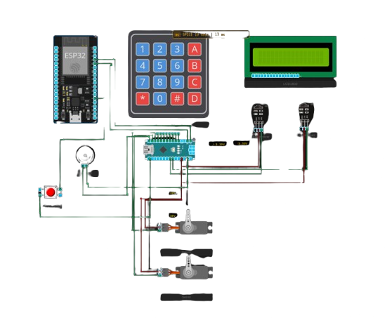
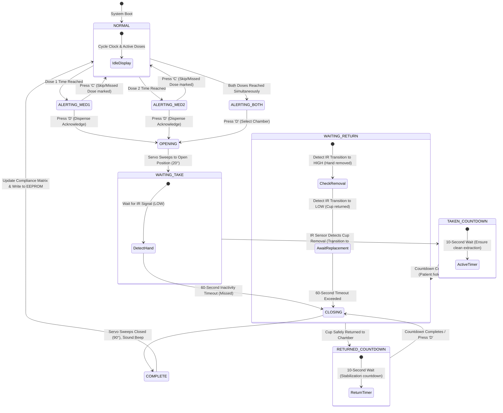
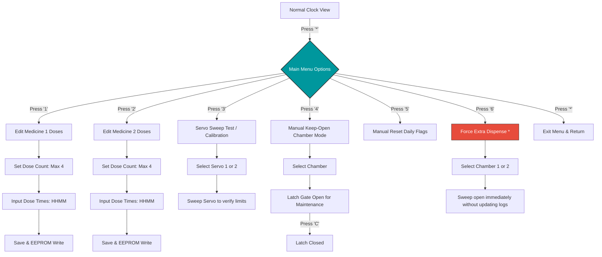

# 💊 Smart Medicine Dispensing & Compliance Monitoring System

An advanced, fail-safe C++/Arduino-based hardware-software solution designed for automated multi-dose scheduling, dual-chamber physical dispensing, and real-time closed-loop compliance tracking with infrared telemetry.

<div align="center">
  
</div>

---

## ⚡ Core Tech Stack & Specifications

<div align="center">


</div>

---

## 🌟 Key Features

*   **📅 Multi-Dose Scheduling Flexibility**: Supports up to **4 configured doses per medicine per day** with independent hourly and minute-level precision, managed dynamically.
*   **👁️ Closed-Loop Compliance Tracking**: Incorporates active Infrared (IR) distance sensors under each slot. The system verifies whether a patient actually removed the medicine cup and physically returned it, flagging missed doses in memory if left unattended.
*   **🚨 Intelligent Non-Blocking Alarms**: Triggers high-tempo buzzers and visual alerts on the LCD. Patients can press `D` to acknowledge and dispense or `C` to skip/postpone.
*   **🔌 Brownout-Protected Actuation**: Employs an ultra-smooth, speed-controlled servo sweep routine with staggered power delays, preventing the high-current drops that typically trigger microcontroller brownouts on 5V USB lines.
*   **🎛️ Onboard Calibration & Interactive UI**: Provides a feature-rich menu to configure dose times, run real-time hardware tests, sweep servos manually for refilling/maintenance, or force manual dispenses.
*   **💾 EEPROM Safe State**: Retains all user-configured schedules, dosage counts, and compliance histories through sudden power cycles or battery dropouts.
*   **🕒 Serial Time Synchronization**: Features a background telemetry check that silently parses incoming timestamps (`HH:MM`) to calibrate the onboard clock.

---

## 📁 Source Code Comparison

The project comes in two specialized, high-reliability software packages depending on your deployment scenario:

| Feature / Metric | 🛠️ Full Enterprise Release <br> `medicine_dispenser_pro_multi.ino` | ⚡ Compact Release <br> `MedicineNewArduinoCode` |
| :--- | :--- | :--- |
| **Code Length** | ~1,540 Lines | ~780 Lines |
| **Footprint / SRAM** | Comprehensive (Optimized state telemetry) | Minimal (Perfect for standard Uno SRAM limits) |
| **Doses Supported** | Up to 4 Doses/Day per chamber | Up to 4 Doses/Day per chamber |
| **Force Dispense (Extra Dose)**| Manual servo open via menu | Instant Menu Option `6` (Bypasses schedule tracking) |
| **Daily Resets** | Menu-triggered / Automatic at midnight | Optimized robust zero-crossing daily reset |
| **Servo Sweep Control** | Advanced power-managed delay curves | Constant speed-controlled safety sweeps |

*   [medicine_dispenser_pro_multi.ino](file:///home/fanaz/Documents/Projects/documents_backup/Medicine%20Dispenser/medicine_dispenser_pro_multi.ino): Ideal for deployments with robust visual menu systems and intensive debug logs.
*   [MedicineNewArduinoCode](file:///home/fanaz/Documents/Projects/documents_backup/Medicine%20Dispenser/MedicineNewArduinoCode): Perfect for memory-constrained Atmega328P chips requiring quick calibration overrides and immediate test features.

---

## 🔌 Hardware Configuration & Pin Map

To ensure physical isolation and steady currents, wire your hardware using the following schema:

| Component | Arduino Uno Pin | Pin Mode / Type | Purpose | Key Details |
| :--- | :--- | :--- | :--- | :--- |
| **LiquidCrystal I2C LCD** | `SDA` & `SCL` | I2C Protocol | Visual Menu & Telemetry UI | Address `0x27`, 16 columns x 2 rows |
| **Servo Motor 1** | `Pin 10` | PWM Output | Gate Control for Chamber 1 | 90° (Closed) to 20° (Open) |
| **Servo Motor 2** | `Pin 11` | PWM Output | Gate Control for Chamber 2 | 90° (Closed) to 20° (Open) |
| **Infrared Sensor 1** | `Pin A1` | Digital Input | Proximity for Chamber 1 | `LOW` = Hand/Cup Detected, `HIGH` = Empty |
| **Infrared Sensor 2** | `Pin A0` | Digital Input | Proximity for Chamber 2 | `LOW` = Hand/Cup Detected, `HIGH` = Empty |
| **Piezo Buzzer** | `Pin 12` | Digital Output | Acoustic Alarm Trigger | Pulsed beeps to prompt patient attention |
| **Keypad Rows 1-4** | `Pins 2, 3, 4, 5` | Input (Pull-up) | Key Matrix Scans | Keypad Interface buttons |
| **Keypad Columns 1-4**| `Pins 6, 7, 8, 9` | Output | Key Matrix Scans | Keypad Interface buttons |

---

## ⚙️ Closed-Loop Compliance State Machine

Rather than blindly dropping pills, the dispenser manages a complex, safety-first compliance state machine. Below is the transition flow:



---

## 🎛️ Keypad Interactive Menu Map

Press `*` on the main interface to unlock the system menu. The menu runs on a non-blocking configuration loop with custom input validation.


*\* Note: Menu Option 6 (Force Extra Dispense) is featured in the compact version (`MedicineNewArduinoCode`).*

### 🎮 Interface Shortcuts
*   `*` Key: Main Menu Entry / Exit / Back Button
*   `C` Key: Emergency Stop (cancels any moving servo immediately) / Skip active alarm / Exit input
*   `D` Key: Accept Time Value / Dismiss Buzzer Alarm and begin dispensing

---

## 🕒 Serial Telemetry & Time Sync Script

To keep the system highly accurate without adding an expensive DS3231 RTC breakout module, you can calibrate the system time silently over the USB Serial line.

Whenever the dispenser receives a serial string in the exact format of `HH:MM\n`, it automatically synchronizes its internal mills-based clock without interrupting screen layouts.

### 🐍 Python Automated Synchronizer (`sync_time.py`)

Create this script in your environment and run it when connecting the system to your computer to automatically sync your local time:

```python
#!/usr/bin/env python3
"""
Smart Medicine Dispenser Serial Clock Sync Tool
"""
import sys
import time
from datetime import datetime

try:
    import serial
except ImportError:
    print("Error: 'pyserial' library not found. Install it using: pip install pyserial")
    sys.exit(1)

# Configuration - Modify to match your microcontroller port
PORT = '/dev/ttyUSB0'  # e.g., 'COM3' on Windows, '/dev/ttyACM0' on Raspberry Pi
BAUD = 9600

def main():
    print(f"Connecting to Medicine Dispenser on port {PORT}...")
    try:
        # Open connection (triggers reboot on standard Arduino setups)
        with serial.Serial(PORT, BAUD, timeout=2) as ser:
            print("Chamber online. Waiting for MCU initialization...")
            time.sleep(2.5)  # Wait for bootloader to finish
            
            current_time = datetime.now().strftime("%H:%M")
            print(f"Acquired Local Time: {current_time}")
            
            # Send sync payload
            ser.write(f"{current_time}\n".encode('utf-8'))
            ser.flush()
            
            print("✔ Time synchronization packets sent successfully!")
            
    except serial.SerialException as e:
        print(f"\n❌ Fail: Serial port connection error. Details: {e}")
        print("Please verify the port name and check if serial monitor is closed.")
    except KeyboardInterrupt:
        print("\nSync aborted by user.")

if __name__ == "__main__":
    main()
```

---

## 🚀 Installation & Compilation Guide

### 1. Prerequisites (Arduino IDE)
Open your Arduino IDE's Library Manager (`Ctrl + Shift + I` or `Cmd + Shift + I`) and install:
1.  **LiquidCrystal_I2C** (by Frank de Brabander or Marco Schwartz)
2.  **Keypad** (by Mark Stanley, Alexander Brevig)
3.  **Servo** (Standard Built-in Library)
4.  **EEPROM** (Standard Built-in Library)

### 2. Circuit Assembly
*   Wire the 16x2 LCD display to your dedicated SDA and SCL channels (analog pins `A4` and `A5` on Arduino Uno).
*   Add **external pull-up resistors** if you experience signals dropping on longer sensor wiring.
*   Ensure that the Servos are powered via a stable 5V rail (preferably backed by a capacitor or separate power adapter if sweeping multiple heavy loads simultaneously).

### 3. Compilation
*   Download and open either [medicine_dispenser_pro_multi.ino](file:///home/fanaz/Documents/Projects/documents_backup/Medicine%20Dispenser/medicine_dispenser_pro_multi.ino) or [MedicineNewArduinoCode](file:///home/fanaz/Documents/Projects/documents_backup/Medicine%20Dispenser/MedicineNewArduinoCode) in the Arduino IDE.
*   Select your Board (`Tools > Board > Arduino Uno`) and the appropriate USB Port.
*   Click **Upload** (`Ctrl + U`).

### 4. Calibration Instructions
*   Enter the Main Menu by pressing `*`.
*   Select `3` to run a calibration sweep. Ensure the servo arm reaches a fully clear opening at `20°` and sits firmly sealed at `90°`.
*   If the arm binds or draws excessive current, refine the `SERVO_MIN_ANGLE` (-70) or `SERVO_MAX_ANGLE` (0) values in your code configurations and flash again.

---

## 📄 License & Credits

Designed and programmed as an advanced, high-compliance health companion project. 

*For system schematics and full presentations, refer to: [Medicine Dispensing and Compliance Monitoring System Using Arduino.pptx](file:///home/fanaz/Documents/Projects/documents_backup/Medicine%20Dispenser/Medicine%20Dispensing%20and%20Compliance%20Monitoring%20System%20Using%20Arduino.pptx).*
